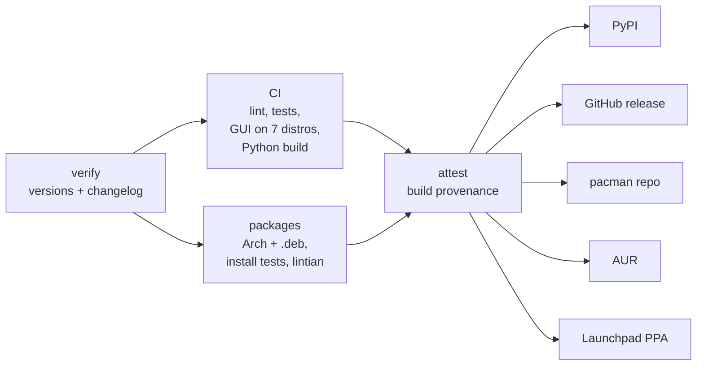

# Contributing to apsta

Thanks for helping! Bug reports with hardware details are as valuable as code.

## Reporting a bug

Please include:

- `apsta --version` and your distribution
- `apsta detect --json`
- `iw phy phy0 info` (use your card's phy)
- the failing command with `APSTA_DEBUG=1`, plus `journalctl -u apsta -u apsta-hostapd -n 100` if relevant

If `apsta detect` gets your card wrong, the `iw phy` output is enough for us to
add a regression test (`tests/fixtures/iw/`).

To test a checkout on real hardware, `sudo scripts/hardware_check.sh` starts
the hotspot, keeps it up while you join from a phone, stops it, checks the
system was restored, and writes `/tmp/apsta-hardware-report.txt` to attach.
`sudo METHOD=p2p scripts/hardware_check.sh` tests the Wi-Fi Direct method on
its own; reports from cards and distributions not yet listed in
[docs/wifi-direct.md](docs/wifi-direct.md) are especially welcome.

## Development setup

```bash
git clone https://github.com/krotrn/apsta && cd apsta

# with uv (recommended): creates .venv with the package + dev tools
uv sync && . .venv/bin/activate

# or with pip >= 25.1
python3 -m venv .venv && . .venv/bin/activate && make dev

make check      # lint + format check + tests with coverage
```

`make dev` installs the dev tools (ruff, coverage) into whichever environment
is active, using uv when available. The dev tools are a PEP 735 dependency
group (`[dependency-groups]` in `pyproject.toml`), so `uv sync` installs them
by default. For the desktop app inside a venv, create it with
`--system-site-packages` so it can see your distribution's PyGObject.

Run your checkout without installing: `./apsta.py detect`, `sudo ./apsta.py start`.

The test suite needs **no root and no WiFi hardware**:

```bash
make test       # python -m unittest discover -s tests -t .
make coverage   # same, with a coverage report (CI requires ≥ 94 %)
make lint       # ruff check + ruff format --check
make fmt        # apply formatting
make gui        # run the desktop app from this checkout
make gui-smoke  # build every GUI view headlessly (see below)
```

### GUI changes

Read "The GUI" in [docs/ARCHITECTURE.md](docs/ARCHITECTURE.md) first. In short:

- The GUI talks to the CLI only (`apsta_gui/backend.py`). Add the operation
  to the CLI first, then call it from the GUI.
- It must run on libadwaita 1.1 / GTK 4.6 (Ubuntu 22.04) and should look
  current on the newest release. Outside `apsta_gui/compat.py`, use only
  libadwaita 1.1 API. For anything newer, add a helper to `compat.py` that
  checks `hasattr(Adw, "Widget")` and falls back. `tests/unit/test_gui.py`
  enforces this.
- Don't block the main loop: run subprocesses through `window.run_async` or
  `window.run_privileged`.
- Escape user-controlled text with `compat.esc()` before putting it in a row,
  toast or status page.
- Keep logic that doesn't need GTK in `helpers.py` or `backend.py`, where it
  can be unit-tested.

Check every view without a desktop session and get screenshots for your PR:

```bash
make gui-smoke                  # writes gui-screenshots/*.png
```

This needs `gtk4-broadwayd` (Arch: `gtk4`, Debian/Ubuntu: `libgtk-4-bin`,
Fedora: `gtk4`) or `Xvfb`. On PyGObject older than 3.44 it still checks every
view but can't take screenshots (Debian 12), or takes them through Xvfb and
ImageMagick (Ubuntu 22.04). CI runs it on Ubuntu 22.04, Debian 12, Ubuntu
24.04, Fedora and Arch and uploads the screenshots as artifacts.

To update the README screenshots, render them with the stock theme so your
own GTK settings don't leak in:

```bash
XDG_CONFIG_HOME=$(mktemp -d) python3 scripts/gui_smoke.py /tmp/shots
cp /tmp/shots/on-hotspot.png docs/screenshots/hotspot.png
cp /tmp/shots/on-clients.png docs/screenshots/devices.png
cp /tmp/shots/on-share.png   docs/screenshots/share.png
cp /tmp/shots/narrow.png     docs/screenshots/narrow.png
cp /tmp/shots/off-single-radio-settings.png docs/screenshots/settings.png
```

## Guidelines

- Read [docs/ARCHITECTURE.md](docs/ARCHITECTURE.md) first. Keep dependencies
  pointing down the layers: `cmd` → `services` → `net`/`hw`/`config` → `core`.
- Start processes only through `core.shell.run` with an argv list. Never
  `shell=True`, and never put secrets in argv.
- Library code raises `ApstaError` subclasses with `hints`. It doesn't print
  advice or call `sys.exit`.
- Any change to system state must be undoable: register a rollback step in the
  `Transaction`, and record what `stop` needs in `HotspotState`.
- Write all files through `core.fsutil.atomic_write`.
- Add tests. Prefer pure functions (parsers, renderers, decisions) with unit
  tests, use `FakeShell` for command sequences, and add an integration test in
  `tests/integration/` for new user-visible behaviour.
- Python ≥ 3.10 and the standard library only for the CLI.
- Commit messages follow [Conventional Commits](https://www.conventionalcommits.org/)
  (`feat:`, `fix:`, `docs:`, `refactor:`, `test:`, `ci:`, `chore:`).
- Add a line to `CHANGELOG.md` under "Unreleased" for user-visible changes.
- `--json` output is a public interface ([docs/json-output.md](docs/json-output.md)):
  add keys freely, and document renames or removals in the changelog.

## Releasing (maintainers)

1. Make sure `CHANGELOG.md` has everything under `## [Unreleased]`.
2. Run the **Version Bump** workflow (Actions → Version Bump → `X.Y.Z`). It
   updates every version field and turns "Unreleased" into
   `## [X.Y.Z] - date`, commits, tags `vX.Y.Z` and starts **Release**.
   Locally, the same steps are:

   ```bash
   python scripts/bump_version.py X.Y.Z
   python scripts/release_check.py X.Y.Z
   git commit -am "chore: release X.Y.Z" && git tag vX.Y.Z && git push origin main vX.Y.Z
   ```

**Release** (`.github/workflows/release.yml`) publishes only after every check
passes:



| Target         | Needs                                                                     |
| -------------- | ------------------------------------------------------------------------- |
| PyPI           | trusted publisher for this repo + `pypi` environment (no stored token)    |
| GitHub release | nothing; notes come from the CHANGELOG section, files get `SHA256SUMS`    |
| pacman repo    | nothing (`ARCH_GPG_PRIVATE_KEY` to sign it)                               |
| AUR            | `AUR_SSH_PRIVATE_KEY`                                                     |
| Launchpad PPA  | `LAUNCHPAD_GPG_PRIVATE_KEY` (+ `LAUNCHPAD_GPG_PASSPHRASE`), `vars.PPA`    |

Targets whose secret is missing are skipped with a notice. Every release
file carries a build-provenance attestation:
`gh attestation verify apsta_X.Y.Z-1_all.deb --repo krotrn/apsta`.

Build packages locally with `packaging/arch/ci-build.sh local` (Arch) or
`packaging/deb/ci-build.sh binary` (on Ubuntu).

### Automation

- **Dependabot** proposes updates to GitHub Actions and the dev tools weekly.
- **CodeQL** scans the Python code and the workflows on every PR and weekly.
