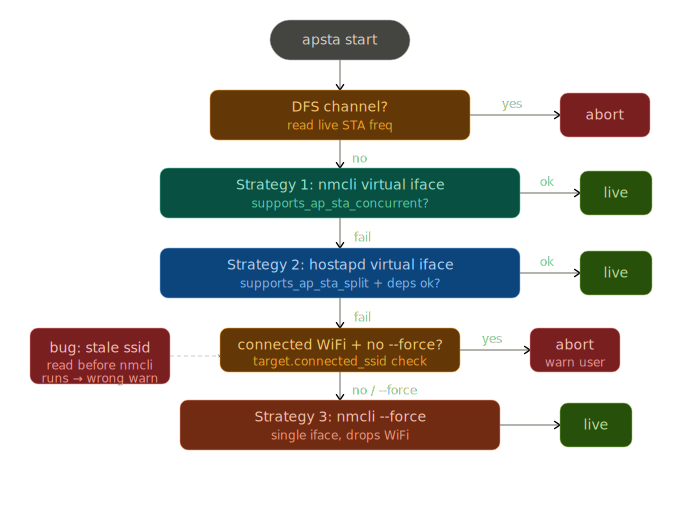

# apsta

**AP+STA WiFi hotspot manager for Linux.**

Stay connected to your WiFi network and broadcast a hotspot simultaneously — without the manual `nmcli` / `hostapd` pain, without dropping your connection, and without touching a config file.

```
$ apsta detect

	apsta — Hardware Detection

	→ Found 1 WiFi interface(s):
			 wlo1  [e4:c7:67:e4:30:ae]  connected to HomeWiFi

	Capability Report
	→ Driver:   iwlwifi
	→ Chipset:  Intel Wi-Fi 6 AX200

	✔  AP mode (hotspot)                      supported
	✔  STA mode (WiFi client)                 supported
	✘  AP+STA simultaneous (nmcli)            not supported
	✔  AP+STA simultaneous (hostapd)          supported

	Verdict
	✔  Your hardware supports AP+STA simultaneously (hostapd mode).
	✔  apsta will use hostapd + dnsmasq to share WiFi without disconnecting.
	→  Run:  sudo apsta start
```

---

## The Problem

On Linux, running a hotspot while staying connected to WiFi is harder than it should be:

- `nmcli device wifi hotspot` **kills your existing WiFi connection** — it takes over the interface completely
- Most WiFi cards don't support concurrent AP+STA mode in the way NetworkManager expects
- Windows handles this transparently via a virtual WiFi layer — Linux doesn't have an equivalent
- NetworkManager doesn't tell you _why_ it failed or _what your options are_
- COSMIC DE has no hotspot UI at all

`apsta` fixes all of this.

---

## How It Works



```
apsta detect
		↓
Parse iw list → find "valid interface combinations"
		↓
Level 1: AP+managed in SAME #{ } block, total >= 2?
	YES → nmcli virtual interface (Strategy 1)

Level 2: AP and managed in SEPARATE #{ } blocks, #channels <= 1?
	YES → hostapd virtual interface (Strategy 2) — Intel AX200, iwlwifi

Neither → explain options → suggest ethernet / USB dongle / --force
```

**Strategy 1 — nmcli concurrent (true hardware AP+STA):**
Creates a virtual `wlo1_ap` interface and runs `nmcli device wifi hotspot` on it.
WiFi stays on `wlo1`. Requires the driver to expose AP+managed in the same
interface combination block.

**Strategy 2 — hostapd concurrent (split-block AP+STA):**
Creates a virtual `wlo1_ap` interface, runs hostapd directly (bypassing nmcli),
assigns IP `192.168.42.1/24`, starts dnsmasq for DHCP, and sets up NAT so
hotspot clients get internet through `wlo1`'s connection. This is how Windows
handles the Intel AX200 — apsta now does the same on Linux.

1. Create virtual `wlo1_ap` on top of `wlo1` (`iw dev wlo1 interface add wlo1_ap type __ap`)
2. Assign randomized locally-administered MAC to `wlo1_ap` — keeps `wlo1` MAC unchanged so NM holds its STA connection
3. Tell NM to ignore `wlo1_ap` only — `wlo1` stays fully managed and connected
4. Run hostapd on `wlo1_ap` with channel matching `wlo1`'s current channel
5. Assign IP `192.168.42.1/24` to `wlo1_ap`
6. Start dnsmasq for DHCP — clients get `192.168.42.10–192.168.42.100`
7. Enable NAT via iptables MASQUERADE so `wlo1_ap` clients get internet through `wlo1`

**Strategy 3 — nmcli --force (drops WiFi):**
Uses the single interface as AP. WiFi disconnects. Only triggered with `--force`.

Key technical decisions:

- **Split-block detection**: parses multi-line `iw list` combinations by joining
  continuation lines before processing — correctly identifies Intel AX200/iwlwifi
  which exposes AP and managed in separate `#{ }` blocks with `#channels <= 1`
- **Channel sync**: reads live STA frequency via `iw dev link` and forces the AP
  to the same channel — prevents `Device or resource busy` on single-radio cards
- **Band sync**: derives band (`a` or `bg`) from frequency — prevents `band bg channel 36` crash
- **DFS channels**: detects regulatory-blocked channels (52–144) and aborts with clear instructions
- **Virtual interface MAC**: randomises the locally-administered MAC (`02:xx:xx:xx:xx:xx`)
  on the AP interface only — base interface MAC stays unchanged so NM keeps its STA connection
- **State persistence**: saves `ap_interface`, `base_interface`, `active_con_name`, and
  `start_method` to `/etc/apsta/config.json` so teardown is exact and method-aware

---

## Project Layout

The codebase is organized into small folder-based packages for readability and
scalability:

- `apsta.py` — CLI launcher and argparse wiring
- `apsta_cli/` — CLI implementation package
- `apsta_cli/cmd/` — user-facing command handlers (detect, status/config, USB)
- `apsta_cli/net/` — hotspot lifecycle internals (start, stop, support helpers)
- `apsta_gui/` — GTK app package
- `apsta_gui/mixins/` — UI page builders and action/polling logic
- `apsta_gtk.py` — GTK launcher
- `gtk-ui/apsta-gtk` — desktop launcher script used by installer/package

This keeps entrypoints tiny and isolates domains so changes stay local.

---

## Install

### For Users

#### One command (recommended)

### 1. Official PPA (Ubuntu / Pop!\_OS) — Recommended

The easiest way to install `apsta` on Ubuntu-based distributions (22.04, 24.04, and Noble) is via the official Launchpad PPA. This ensures you get automatic updates and all system dependencies (like `hostapd` and `dnsmasq`) are handled for you.

```bash
sudo add-apt-repository ppa:krotrn/apsta
sudo apt update
sudo apt install apsta
```

### 2. Manual One-Liner (Python pipx)

If you are on a different distribution (Fedora, Arch, etc.) or prefer using `pipx`, use this one-liner to install the dependencies and the app:

```bash
sudo apt update && sudo apt install -y pipx network-manager iw iproute2 usbutils pciutils hostapd dnsmasq python3-gi gir1.2-gtk-4.0 gir1.2-adw-1 python3-qrcode python3-pil && pipx ensurepath && pipx install git+https://github.com/krotrn/apsta.git
```

### 3. Development / Source Install

If you want to contribute or build from source:

```bash
git clone https://github.com/krotrn/apsta
cd apsta
# Install the CLI and GTK UI locally
pipx install .
# Or run the manual install script
sudo ./install.sh
```

### For Maintainers

#### Publish APT package (enables `sudo apt install apsta`)

`sudo apt install apsta` works after you publish this package in an APT repository (PPA).

Build a local Debian package:

```bash
sudo apt update && sudo apt install -y build-essential debhelper dh-python pybuild-plugin-pyproject python3-all python3-setuptools dpkg-dev
dpkg-buildpackage -us -uc -b
```

Install the built package locally:

```bash
sudo apt install ../apsta_*_all.deb
```

To enable `sudo apt install apsta` for other users, publish the generated `.deb` to your APT repo and add that repo to user systems.

#### Publish: Launchpad PPA

1. Create a PPA in Launchpad.
2. Create the upstream orig tarball (required for `3.0 (quilt)`):

```bash
UPVER="$(dpkg-parsechangelog -SVersion | sed 's/-[^-]*$//')"
git ls-files -z | grep -zv '^debian/' | tar --null -T - -czf "../apsta_${UPVER}.orig.tar.gz" --transform "s,^,apsta-${UPVER}/,"
```

3. Build source package from the repo root:

```bash
debuild -S -sa -k<your-gpg-key-id>
```

4. Upload to PPA:

```bash
dput ppa:<launchpad-user>/<ppa-name> ../apsta_*_source.changes
```

5. Users install:

```bash
sudo add-apt-repository ppa:<launchpad-user>/<ppa-name>
sudo apt update
sudo apt install apsta
```

**Required dependencies** (all default on Ubuntu/Pop!\_OS/Fedora/Arch):
`nmcli` · `iw` · `ip` · `lsusb` · `lspci`

**For hostapd mode** (Intel AX200 and similar split-block cards):

```bash
sudo apt install hostapd dnsmasq
```

apsta will prompt if these are missing when hostapd mode is needed.

**Python 3.8+** required.

---

## CLI Usage

```bash
# Show version
apsta --version

# Detect hardware capability (shows both nmcli and hostapd support levels)
apsta detect

# Detect/status as machine-readable JSON
apsta detect --json
apsta status --json

# Start hotspot (auto-detects best method — tries nmcli, then hostapd, then --force)
sudo apsta start

# Start even if AP+STA not supported (drops WiFi)
sudo apsta start --force

# Stop hotspot (method-aware: cleans up hostapd/dnsmasq/iptables if needed)
sudo apsta stop

# Show current state (shows connected clients in hostapd mode)
apsta status

# Configure SSID and password
apsta config --set ssid=MyHotspot
sudo apsta config --set password=secret123

# Manage named profiles
apsta profile list
sudo apsta profile create travel
sudo apsta profile use travel
apsta profile show travel

# Scan plugged-in USB WiFi adapters
apsta scan-usb

# Suggest a USB adapter to buy
apsta recommend

# Auto-start on boot + survive sleep/wake
sudo apsta enable
sudo apsta disable
```

### Shell completion

Generate completion scripts directly from apsta:

```bash
apsta completion bash
apsta completion zsh
apsta completion fish
```

Install manually:

```bash
# bash
apsta completion bash | sudo tee /etc/bash_completion.d/apsta >/dev/null

# zsh
apsta completion zsh | sudo tee /usr/local/share/zsh/site-functions/_apsta >/dev/null

# fish
apsta completion fish | sudo tee /etc/fish/completions/apsta.fish >/dev/null
```

---

### GTK4 / Libadwaita (GNOME, KDE, Xfce, any desktop)

Full three-page GUI: Status, Hardware, Settings. Force start toggle for single-radio cards.

```bash
apsta-gtk
```

`apsta-gtk` is installed by the same one-command package install.

Requires: `python3-gi`, `gir1.2-gtk-4.0`, `gir1.2-adw-1`, `python3-qrcode`, `python3-pil`

```bash
sudo apt install python3-gi gir1.2-gtk-4.0 gir1.2-adw-1 python3-qrcode python3-pil
```

---

## Auto-start and Sleep/Wake Persistence

```bash
sudo apsta enable
```

This installs:

- **`/etc/systemd/system/apsta.service`** — starts hotspot after NetworkManager connects on boot (`nm-online -q` pre-condition, not a fragile `sleep 3`)
- **`/usr/lib/systemd/system-sleep/apsta-sleep`** — tears down hotspot before suspend, restores it after resume (works for both nmcli and hostapd modes)

Works on **systemd**, **OpenRC**, and **runit**. Non-systemd users get exact manual instructions and pm-utils hook installation if available.

---

## USB Dongle Support

If your built-in card doesn't support either AP+STA mode:

```bash
# See what's plugged in
apsta scan-usb

# See what to buy
apsta recommend
```

Recommended chipsets (in-kernel drivers, plug and play):

| Chipset  | WiFi Gen | Driver  | Notes                         |
| -------- | -------- | ------- | ----------------------------- |
| mt7921au | WiFi 6   | mt7921u | Best overall. Kernel 5.19+    |
| mt7612u  | WiFi 5   | mt76x2u | Rock-solid, works everywhere  |
| mt7610u  | WiFi 5   | mt76x0u | AC600, great for hotspot-only |
| mt7925u  | WiFi 7   | mt7925u | Newest. Kernel 6.7+           |

Realtek chipsets are intentionally excluded — out-of-kernel drivers, unreliable AP+STA.

---

## Compatibility

| Distro               | CLI | GTK UI |
| -------------------- | --- | ------ |
| Pop!\_OS 22.04       | ✅  | ✅     |
| Pop!\_OS COSMIC      | ✅  | ✅     |
| Ubuntu 22.04 / 24.04 | ✅  | ✅     |
| Fedora 39+           | ✅  | ✅     |
| Arch Linux           | ✅  | ✅     |
| Alpine (OpenRC)      | ✅  | ✅     |
| Artix (runit)        | ✅  | ✅     |

**Tested hardware:**

- Intel Wi-Fi 6 AX200 (iwlwifi) — hostapd mode ✅
- MediaTek mt7921au USB — nmcli mode ✅

---

## Why This Exists

Built out of fration with Pop!\_OS COSMIC's missing hotspot UI and the silent WiFi-disconnection behaviour of `nmcli hotspot`. The deeper problem: Windows implements a virtual WiFi multiplexing layer that makes AP+STA work on almost any card. Linux exposes raw hardware capability honestly — and for cards like the Intel AX200, that capability exists but nmcli can't use it. apsta bridges the gap using hostapd directly.

If you've ever typed:

```bash
nmcli device wifi hotspot ifname wlan0 ssid foo password bar
```

...and watched your SSH session drop — this is for you.

---

## Contributing

PRs welcome. The Python CLI has no dependencies beyond stdlib (plus optional hostapd/dnsmasq). The GTK UI requires PyGObject.

If you've tested on a distro or hardware not in the tables above, open an issue with your `apsta detect` output.

---

## License

MIT
