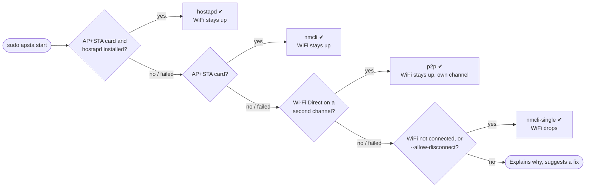

# apsta: Linux Wi-Fi hotspot that keeps your Wi-Fi connected

**Run a WiFi hotspot on Linux while staying connected to WiFi.**

[](https://github.com/krotrn/apsta/actions/workflows/ci.yml)
[](https://pypi.org/project/apsta/)
[](https://pypi.org/project/apsta/)
[](https://github.com/krotrn/apsta/blob/main/LICENSE)

apsta is a command-line tool and GTK 4 desktop app for Linux that shares your
internet over a Wi-Fi hotspot while the same Wi-Fi card stays connected to
your Wi-Fi network (AP+STA mode). It works with NetworkManager, hostapd and
dnsmasq on Ubuntu, Debian, Fedora, Arch and other distributions.

`nmcli device wifi hotspot` takes over your WiFi card and drops your
connection. Most modern cards can actually be a client and an access point at
the same time ("AP+STA"). apsta finds out whether yours can, sets the hotspot
up the right way for it, keeps it healthy, and cleans up completely when you
stop it.

<p align="center">
  
</p>

```
$ apsta detect

Capability report for wlo1
  →  Driver:   iwlwifi
  →  Chipset:  Intel Corporation Wi-Fi 6 AX200

     ✔  AP mode (hotspot)                    yes
     ✔  STA mode (WiFi client)               yes
     ✔  AP + STA at the same time            yes
     ✘  AP on a different channel than STA   no

Methods
     hostapd  ready
     nmcli    ready

Verdict
  ✔  Your card can run a hotspot while staying connected to WiFi.
  ✔  The hotspot will use the same channel as your WiFi connection.
  →  Next: sudo apsta start
```

## Features

- **Reads the hardware properly**: parses the driver's interface combinations
  to decide whether AP+STA is possible and whether the hotspot must share the
  WiFi channel.
- **Keeps your connection**: the hotspot runs on a virtual interface. If
  your WiFi's channel can't host (radar/DFS channels, or 5 GHz channels the
  card blocks), it runs as a Wi-Fi Direct group on a channel of its own, as
  Windows does, on cards that support that. A mode that drops WiFi is used
  only if you allow it (`--allow-disconnect`).
- **All-or-nothing setup**: every step registers its own undo, so a failure
  part-way leaves nothing behind, and `stop` removes exactly what `start` added.
- **Stays up**: a watcher restarts the hotspot after suspend/resume or a
  driver reset, moves it when your WiFi changes channel, and steps aside when
  it would keep your WiFi from reconnecting.
- **Works with your firewall**: firewalld, iptables (including ufw/docker
  setups) and nftables. Picks a hotspot subnet that doesn't clash with your
  networks. DNS goes through your normal resolver, so captive portals and VPN
  DNS keep working.
- **Fast**: 802.11n/ac + WMM, and the right regulatory country code.
- **Client management** (hostapd mode): list, kick, block, and rate-limit
  clients, or let only the devices you list join.
- **Hidden network** option, and a QR code to join (`apsta qr` or the app).
- **Safe by default**: a random password on first start (never a shared
  default), passwords never on a command line, a scoped polkit action for the
  GUI.
- **Desktop app** (GTK 4/libadwaita) with device management, QR-code sharing
  and a system tray icon.

## Install

### Ubuntu / Pop!\_OS (PPA)

```bash
sudo add-apt-repository ppa:krotrn/apsta
sudo apt update
sudo apt install apsta
```

### Arch Linux and derivatives

```bash
sudo tee -a /etc/pacman.conf >/dev/null <<'CONF'

[apsta]
SigLevel = Optional TrustAll
Server = https://github.com/krotrn/apsta/releases/download/arch-repo
CONF
sudo pacman -Sy apsta          # or: yay -S apsta
sudo pacman -S --needed hostapd dnsmasq   # recommended (hostapd mode)
```

### From source (any distribution)

```bash
git clone https://github.com/krotrn/apsta && cd apsta
sudo ./install.sh              # installs into /usr/local
sudo ./install.sh --uninstall  # removes it again
```

Runtime requirements: Python ≥ 3.10, NetworkManager, `iw`, `iproute2`.
Recommended: `hostapd` + `dnsmasq` (needed for client management), and one of
`iptables`/`nftables`/`firewalld`. On Fedora, openSUSE, Alpine and Void, the
Python library `jeepney` enables the [Wi-Fi Direct fallback](https://github.com/krotrn/apsta/blob/main/docs/wifi-direct.md). Desktop app: see [Desktop app](#desktop-app).

> **pipx/pip users:** `sudo` can't see `~/.local/bin`. Install system-wide
> with `sudo pipx install --global apsta` (pipx ≥ 1.5), or use the packages above.

## Usage

```bash
apsta detect                         # what can my card do?
sudo apsta start                     # start (keeps WiFi when the card allows it)
sudo apsta start --allow-disconnect  # also allow a mode that drops WiFi
sudo apsta stop
apsta status                         # --check: exit code only (0 running, 3 not)

sudo apsta enable                    # start at boot, recover after sleep (systemd/OpenRC/runit)
sudo apsta disable
```

### Configuration

```bash
apsta config                              # show the active profile
sudo apsta config --set ssid=MyHotspot --set band=a
sudo apsta config --set method=p2p --set channel=149   # own channel, always on 5 GHz 149
sudo apsta config --password-stdin        # prompts; nothing ends up in shell history
sudo apsta config --generate-password
sudo apsta config --show-password
sudo apsta qr                             # QR code a phone camera can scan to join

apsta profile list
sudo apsta profile create travel
sudo apsta profile use travel
```

Settings:

| Setting | Values | Meaning |
| ------- | ------ | ------- |
| `ssid`, `password` | | The network's name and password |
| `band` | `bg` (2.4 GHz), `a` (5 GHz) | Used whenever the hotspot has a channel of its own |
| `channel` | `auto` (default) or a number | `auto` picks the least crowded channel the card allows |
| `method` | `auto` (default), `hostapd`, `nmcli`, `p2p`, `nmcli-single` | How the hotspot runs. `p2p` (Wi-Fi Direct) always uses your band and channel, at the cost of shared speed ([details](https://github.com/krotrn/apsta/blob/main/docs/wifi-direct.md)) |
| `interface` | `auto` (default) or a name | Which WiFi card to use |
| `hidden` | `yes`, `no` | Stop broadcasting the name; devices type it or scan the QR code |
| `allowed_macs` | MAC list | Only these devices may join (see below) |

On most laptop cards a normal hotspot has to share your WiFi's channel, so
`band` and `channel` can't always be followed. apsta never ignores them
silently: `apsta start`, `apsta status` and the app's *Why it runs this way*
section say what it chose and why, and so does `/var/log/apsta.log`.

Configuration lives in `/etc/apsta/` and passwords in the root-only
`/etc/apsta/secrets.json`.

### Clients (hostapd mode)

```bash
apsta clients                               # connected stations with IP/hostname
sudo apsta clients disconnect phone         # by hostname, IP or MAC
sudo apsta clients disconnect phone --block # and keep it out
sudo apsta clients unblock aa:bb:cc:dd:ee:ff
sudo apsta clients limit 192.168.42.17 8000 # Kbps, upload and download
sudo apsta clients unlimit 192.168.42.17
```

To let only your own devices join, list their MAC addresses. Anyone else is
refused even with the password. This needs hostapd mode; apsta won't start a
hotspot it can't restrict.

```bash
sudo apsta config --set allowed_macs="aa:bb:cc:dd:ee:ff, 11:22:33:44:55:66"
sudo apsta config --set allowed_macs=      # anyone with the password again
```

Phones often use a random MAC per network: look up the one they use for your
hotspot (Android: *Wi-Fi → your hotspot → Privacy*, or set it to the device
MAC; iPhone: *Private Wi-Fi Address*).

### Scripting

`status`, `detect`, `config`, `clients` and `start` accept `--json`. See
[docs/json-output.md](https://github.com/krotrn/apsta/blob/main/docs/json-output.md) for the keys and exit codes.

```bash
apsta status --json | jq -r '.clients[].ip'
```

## Desktop app

<p>
  
  
</p>
<p>
  
  
</p>

Open **Hotspot (apsta)** from your app menu, or run `apsta-gtk`.

- **Hotspot**: one button to start/stop, whether you're still connected to
  your WiFi, connection details, a profile switcher, and **Share**: a QR code
  phones can scan, plus the password.
- **Devices**: everything connected, with a menu per device to limit its
  speed, disconnect it, or block it. Blocked devices can be unblocked here.
- **Settings**: network name, password, band, interface, profiles, *Start
  automatically* (boot + recovery after sleep), *Show in the tray at login*,
  and what your WiFi card supports.

The window adapts to its size (tabs move to the bottom on narrow windows),
and follows your light/dark preference. Shortcuts: <kbd>Ctrl</kbd>+<kbd>R</kbd>
or <kbd>F5</kbd> refresh, <kbd>Ctrl</kbd>+<kbd>Q</kbd> quit.

**System tray.** While the app runs, an icon in the panel shows whether the
hotspot is on and how many devices are connected. Right-click it to start or
stop the hotspot, share it, open the device list, switch profile or band, turn
*Start automatically* on or off, or open Settings. Clicking the icon shows or
hides the window, and closing the window keeps the app in the tray. Turn on
*Show in the tray at login* in Settings (or run `apsta-gtk --background`) to
start straight into the tray. It works wherever the panel supports
StatusNotifierItem: KDE Plasma, Xfce, Cinnamon, MATE, Budgie, LXQt, waybar and
other Wayland bars, and GNOME with the AppIndicator extension (included in
Ubuntu). Bars that only support the old XEmbed tray, such as i3bar and polybar,
need [snixembed](https://git.sr.ht/~steef/snixembed). Without a tray, the app
works as before: closing the window quits it.

Starting, stopping and changing settings ask for your password through
polkit. It's remembered for a few minutes, so you aren't asked on every click.

**Requirements.** The packages above install everything. From source, install
your distribution's GTK bindings:

| Distribution           | Packages                                                                              |
| ---------------------- | ------------------------------------------------------------------------------------- |
| Ubuntu / Debian / Mint | `python3-gi gir1.2-gtk-4.0 gir1.2-adw-1 python3-qrcode python3-pil`                   |
| Fedora                 | `python3-gobject gobject-introspection gtk4 libadwaita python3-qrcode python3-pillow`  |
| Arch                   | `python-gobject gtk4 libadwaita python-qrcode python-pillow`                           |

It works with libadwaita 1.1 / GTK 4.6 and newer, and uses newer libadwaita
features when your system has them. CI checks it on Ubuntu 22.04, Debian 12,
Ubuntu 24.04, Fedora and Arch. `python3-qrcode` is optional; without it,
Share shows the name and password only.

### Shell completion

```bash
apsta completion bash | sudo tee /etc/bash_completion.d/apsta >/dev/null
apsta completion zsh  | sudo tee /usr/local/share/zsh/site-functions/_apsta >/dev/null
apsta completion fish | sudo tee /etc/fish/completions/apsta.fish >/dev/null
```

## How it works

`apsta start` picks the first method that works on your machine:

| Method         | When                                    | WiFi stays up | Client management |
| -------------- | --------------------------------------- | ------------- | ----------------- |
| `hostapd`      | card supports AP+STA, hostapd installed | yes           | yes               |
| `nmcli`        | card supports AP+STA                    | yes           | list/kick         |
| `p2p`          | WiFi's channel can't host; card can run Wi-Fi Direct on a second channel | yes (speed shared) | list/kick |
| `nmcli-single` | card supports AP only                   | **no**        | list/kick         |


```mermaid
flowchart LR
    S(["sudo apsta start"]) --> H{"AP+STA card and<br/>hostapd installed?"}
    H -- "yes" --> HA["hostapd ✔<br/>WiFi stays up"]
    H -- "no / failed" --> N{"AP+STA card?"}
    N -- "yes" --> NM["nmcli ✔<br/>WiFi stays up"]
    N -- "no / failed" --> P{"Wi-Fi Direct on a<br/>second channel?"}
    P -- "yes" --> PG["p2p ✔<br/>WiFi stays up, own channel"]
    P -- "no / failed" --> D{"WiFi not connected, or<br/>--allow-disconnect?"}
    D -- "yes" --> NS["nmcli-single ✔<br/>WiFi drops"]
    D -- "no" --> E(["Explains why, suggests a fix"])
```

A method that fails part-way is rolled back completely before the next one
is tried.

On single-channel cards (most laptop chips) the hotspot has to use the same
channel as your WiFi. apsta reads it from the live connection. Some channels
can't host a hotspot: radar (DFS) channels 52–144, 6 GHz, and 5 GHz channels
the card's firmware blocks. On cards that can run a Wi-Fi Direct group on a
second channel (most Intel cards) apsta then gives the hotspot a channel of
its own; the radio switches between the two, so they share its speed. See
[docs/wifi-direct.md](https://github.com/krotrn/apsta/blob/main/docs/wifi-direct.md) for which cards and distributions
support it. On other cards apsta refuses with an explanation; see
[docs/5ghz-wifi.md](https://github.com/krotrn/apsta/blob/main/docs/5ghz-wifi.md).
The hotspot follows the connection when it changes channel (on systemd,
also when started with `apsta start` or the GUI).

New to this? [docs/how-it-works.md](https://github.com/krotrn/apsta/blob/main/docs/how-it-works.md) explains it in plain
language, with the common problems and fixes. For the design, see
[docs/ARCHITECTURE.md](https://github.com/krotrn/apsta/blob/main/docs/ARCHITECTURE.md).

## Troubleshooting

- **Won't start while connected to a 5 GHz network** (e.g. a phone hotspot
  or a campus network on a DFS channel)? Your card can't host on that channel
  and has no [Wi-Fi Direct fallback](https://github.com/krotrn/apsta/blob/main/docs/wifi-direct.md) (`apsta detect`
  shows whether it does, and what's missing).
  Switch the network to 2.4 GHz, or see [docs/5ghz-wifi.md](https://github.com/krotrn/apsta/blob/main/docs/5ghz-wifi.md)
  for why and the other fixes.
- `APSTA_DEBUG=1 sudo apsta start` prints every step; privileged runs also log
  JSON lines to `/var/log/apsta.log`.
- The service's own log: `journalctl -u apsta`.
- In hostapd mode, `journalctl -u apsta-hostapd -u apsta-dnsmasq` shows the
  daemons' own logs.
- Wrong verdict from `apsta detect`? Please open an issue with
  `apsta detect --json` and `iw phy phy0 info`.

**Desktop app:**

- *"No polkit authentication agent is running"*: your session has no agent to
  ask for the password. GNOME, KDE, Cinnamon, MATE and Xfce start one; on
  i3/sway/Hyprland start one yourself, e.g. `polkit-gnome` or `lxpolkit`.
- *"Not authorized"*: your account isn't an administrator (not in `sudo` /
  `wheel`).
- *"apsta is not installed"* window: the desktop app can't find the `apsta`
  command. Install the CLI (it's in the same package) or put it on `PATH`.
- Settings changes apply to the next start; stop and start the hotspot.

If your card can't do AP+STA, `apsta recommend` suggests USB adapters with
in-kernel drivers that can (MediaTek mt7921au, mt7612u, mt7610u, mt7925u).

## Compared with other tools

| | Keeps your Wi-Fi connected | Picks a mode for your card | Own channel when Wi-Fi is on a DFS / "no IR" channel | Undoes a failed start | GUI |
| --- | --- | --- | --- | --- | --- |
| **apsta** | yes, when the card supports AP+STA | yes (`apsta detect`) | yes, as a Wi-Fi Direct group (most Intel cards) | yes, step by step | GTK 4 |
| `nmcli device wifi hotspot` / GNOME Settings hotspot | no, the card becomes the hotspot | no | no | n/a | GNOME Settings |
| [create_ap](https://github.com/oblique/create_ap) | yes, with a virtual interface | partly | no | partly | no (archived in 2021) |
| [linux-wifi-hotspot](https://github.com/lakinduakash/linux-wifi-hotspot) | yes, with a virtual interface | partly | no | partly | GTK 3 |
| hostapd + dnsmasq by hand | if you set it up | you decide | you set it up | no | no |

apsta also handles firewalld, iptables and nftables, picks a subnet that
doesn't clash with your networks, follows your Wi-Fi when it changes
channel, and survives suspend/resume.

## Supported hardware

Any card whose driver reports an AP+STA interface combination can run a
hotspot while staying connected. `apsta detect` tells you for your card.

| Card / chipset | Driver | Status |
| --- | --- | --- |
| Intel Wi-Fi 6 AX200, AX201 | `iwlwifi` (`iwlmvm`) | AP+STA on the Wi-Fi channel; Wi-Fi Direct fallback tested on AX201 |
| Other Intel Wi-Fi 5/6/6E (7260 … AX211) | `iwlwifi` (`iwlmvm`) | Expected to work like the AX201 |
| Intel Wi-Fi 7 (BE200 …) | `iwlwifi` (`iwlmld`) | Unknown, reports welcome |
| MediaTek USB: mt7921au, mt7925u, mt7612u, mt7610u | `mt76` family | AP+STA (suggested by `apsta recommend`) |
| Realtek, Qualcomm/Atheros, Broadcom | various | Depends on the driver; run `apsta detect` |

Tried apsta on a card that isn't listed? Please
[open a hardware report](https://github.com/krotrn/apsta/issues/new?template=hardware_report.yml)
with `apsta detect --json`.

## FAQ

### How do I share Wi-Fi over Wi-Fi on Linux without disconnecting?

Install apsta and run `sudo apsta start`. If your card supports AP+STA, the
hotspot runs on a second, virtual interface and your Wi-Fi connection stays
up. `apsta detect` tells you beforehand whether your card can.

### Why does `nmcli device wifi hotspot` disconnect my Wi-Fi?

NetworkManager's hotspot turns the card itself into an access point, so it
can no longer be a client. apsta adds a separate access-point interface next
to the client one instead.

### How do I check if my Wi-Fi card supports AP+STA?

Run `apsta detect`. It reads the driver's interface combinations (the same
data as `iw phy phy0 info`) and says whether AP and client can run at the
same time, and whether they must share a channel.

### Can I run a 5 GHz hotspot while connected to Wi-Fi?

On most laptop cards the hotspot must use the same channel as your Wi-Fi, so
it's 5 GHz when your Wi-Fi is on 5 GHz. Radar (DFS) channels and channels the
firmware blocks can't host a hotspot; on those, apsta uses a Wi-Fi Direct
group on its own channel when the card supports it. See
[5 GHz Wi-Fi](https://github.com/krotrn/apsta/blob/main/docs/5ghz-wifi.md).

### Which distributions does it work on?

Any Linux distribution with NetworkManager, `iw` and `iproute2`, and
Python 3.10 or newer. There are packages for Ubuntu and Pop!\_OS (PPA) and
Arch Linux, a package on PyPI, and an installer for everything else. CI
tests Ubuntu 22.04 and 24.04, Debian 12, Fedora and Arch.

### Is apsta an alternative to create_ap?

Yes. create_ap was archived in September 2021 and is no longer maintained.
apsta covers the same use case (a hotspot from a Wi-Fi card that stays
connected) and adds capability detection, a Wi-Fi Direct fallback, full
rollback and a desktop app.

## Contributing

Contributions are welcome. See [CONTRIBUTING.md](https://github.com/krotrn/apsta/blob/main/CONTRIBUTING.md). The test
suite runs without root or WiFi hardware.

Security issues: see [SECURITY.md](https://github.com/krotrn/apsta/blob/main/SECURITY.md).

## License

MIT

<a href="https://www.buymeacoffee.com/krotrn" target="_blank"></a>
