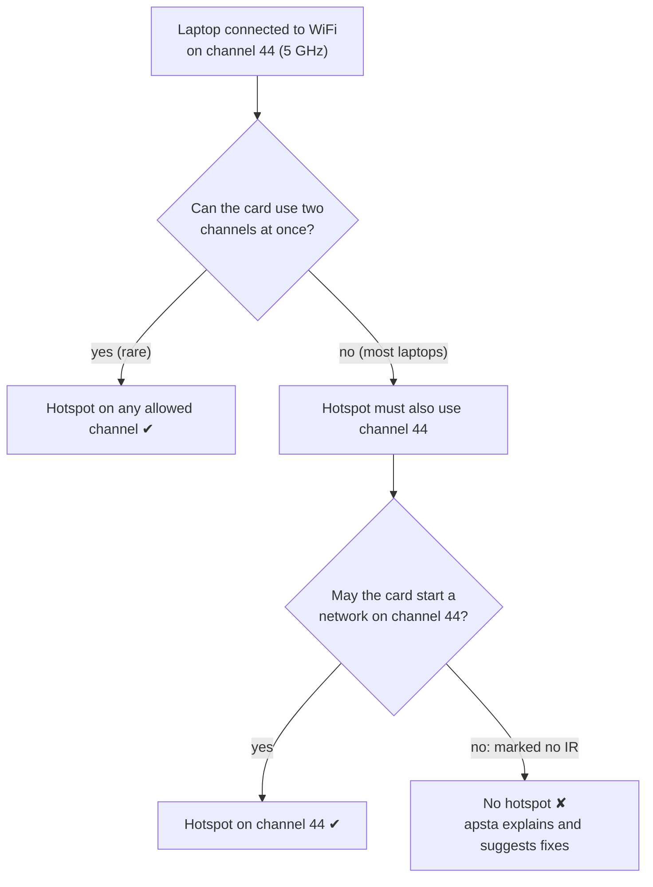
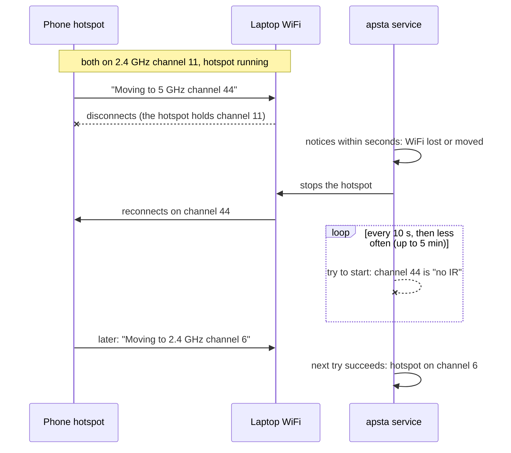

# Hotspot won't start while your WiFi is on 5 GHz

You're connected to a 5 GHz network and `apsta start` refuses:

```
Your WiFi is connected on 5 GHz channel 44, where this card isn't allowed to
start a network (marked "no IR" by its firmware/regulatory rules). It can only
run the hotspot on the same channel as your WiFi.
```

On older versions you saw driver errors instead, such as hostapd *"not
broadcasting"* or NetworkManager's *"No suitable device found"*.

The same laptop may have worked fine yesterday. What changed is the network
you're connected to, not apsta.

## Why it happens

Two rules of your WiFi card combine.

**1. The hotspot must use the same channel as your WiFi.**
Most laptop cards (Intel, Realtek, most MediaTek) have one radio. To be
connected to WiFi *and* run a hotspot at the same time, both have to sit on
one channel. If your WiFi is on channel 44, the hotspot has to be on 44 too.
`apsta detect` shows this as *"The hotspot will use the same channel as your
WiFi connection."*

**2. The card may not be allowed to start a network on that channel.**
Radio rules differ by country. To stay within them without knowing where it
is, the card's firmware lets it *join* networks on many 5 GHz channels but
only *start* one on a few. Channels where it can only join are marked
**"no IR"** (no "initiating radiation"). On Intel cards that's typically 5 GHz
channels 36–144; channels 149–165 and all 2.4 GHz channels are usually
allowed.

Put together:



The firmware enforces this; apsta can't and shouldn't override it.

Common situations:

- **Phone hotspot as your internet.** Many phones (Xiaomi/Redmi, Samsung,
  Pixel) run their hotspot on 5 GHz, and some switch bands on their own. That
  is why it can work one day and not the next.
- **Dual-band router** with one name for both bands. Your laptop picks 5 GHz
  when the signal is good.

## Check whether you're affected

```sh
apsta detect
```

shows a warning and a "Hotspot on 5 GHz" row:

```
✔  Your card can run a hotspot while staying connected to WiFi.
⚠  Your WiFi is on 5 GHz channel 44, where this card can't host.
⚠  Switch that network to 2.4 GHz, or connect to a 2.4 GHz network, then start.
⚠  Why: https://github.com/krotrn/apsta/blob/main/docs/5ghz-wifi.md
```

The raw data: `iw dev` shows your WiFi channel, and
`iw phy phy0 info` lists every channel. The ones marked `(no IR)`,
`(radar detection)` or `(disabled)` can't host.

No warning doesn't mean you're safe for good: a network that switches bands
by itself can be on 2.4 GHz now and on 5 GHz in an hour. See the next section.

## When the network switches band while the hotspot is running

Phone hotspots set to an automatic band (often the default) move between
2.4 and 5 GHz by themselves, without you touching anything. Your laptop
follows, because it has to stay on the phone's channel. You can see it in
the system log:

```sh
journalctl -k | grep "switches to different band"
```

```
wlo1: AP aa:bb:cc:dd:ee:ff switches to different band (5220 MHz, ...), disconnecting
```

If it moves to a channel your card can't host on, the hotspot can't keep
running there. What happens next depends on how you started it:



- **`sudo apsta start`** (one-off): nothing watches the hotspot. Your laptop
  usually loses its connection to the phone, because the hotspot still holds
  the old channel, so devices on your hotspot lose internet. Run
  `sudo apsta stop`; start again once the network is back on 2.4 GHz.
- **As a service** (`sudo apsta enable`, or `sudo apsta run` in a terminal):
  apsta notices within seconds, stops the hotspot so your WiFi can reconnect,
  and keeps trying to start it again, at first every 10 seconds, then less
  often, up to every 5 minutes. When the network is back on 2.4 GHz, the
  hotspot comes back by itself. `journalctl -u apsta` shows what it's doing.

Neither can keep the hotspot up while the network is on such a channel. The
lasting fix is to stop the network from switching: set its band to 2.4 GHz
explicitly (below).

## Fixes

Pick whichever suits you:

1. **Move your WiFi to 2.4 GHz.** Simplest, keeps everything else the same.
   - Phone hotspot: *Settings → Hotspot → AP band → 2.4 GHz* (the wording
     varies; on Xiaomi/Redmi: *Connection & sharing → Portable hotspot → Set
     up portable hotspot → AP band*). Pick 2.4 GHz explicitly: "auto" or
     "5 GHz preferred" can switch back to 5 GHz at any time.
   - Router: connect to its 2.4 GHz network. If both bands share a name, many
     routers let you split them in their settings.

   Then reconnect and run `sudo apsta start`.

2. **Get internet another way, then let apsta drop WiFi.** For example, plug
   the phone in with USB and turn on *USB tethering*, or use ethernet. Then:

   ```sh
   sudo apsta start --allow-disconnect
   ```

   apsta disconnects the WiFi and hosts on a channel the card allows (for
   example 5 GHz channel 149, which is fast). Internet comes over the cable.

3. **Use a USB WiFi adapter for the hotspot.** It has its own radio, so your
   built-in card can stay on any channel:

   ```sh
   sudo apsta start --interface wlan1
   ```

   `apsta recommend` lists adapters with in-kernel Linux drivers.

## Why apsta doesn't work around it

- **Hosting on the "no IR" channel anyway**: the firmware refuses, and doing so
  would break radio regulations.
- **Using a different channel for the hotspot**: some cards (Intel included)
  can run a *Wi-Fi Direct* group on a second channel. We tested this on an
  Intel AX201: the card does it, but NetworkManager immediately removes any
  Wi-Fi Direct group it didn't start itself, and there is no setting to stop
  that. Working around it would mean taking WiFi away from NetworkManager,
  which is too fragile for a hotspot tool.

So apsta tells you up front and suggests the fixes above, instead of trying
and failing with driver errors.
