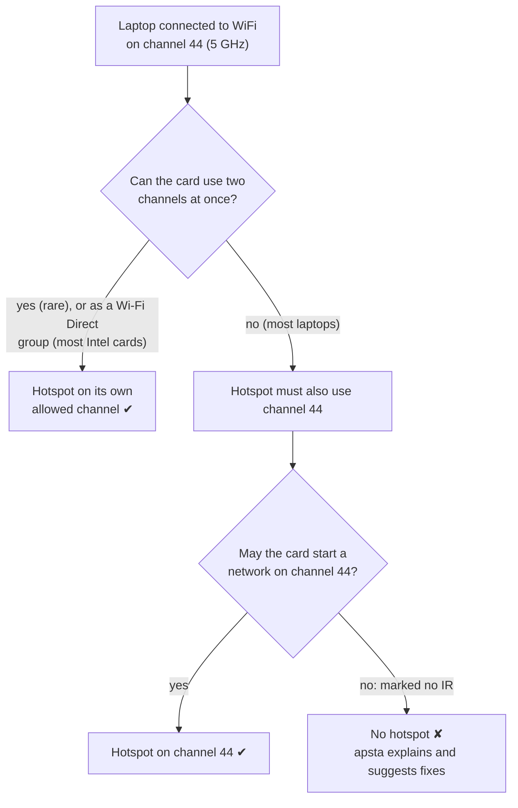
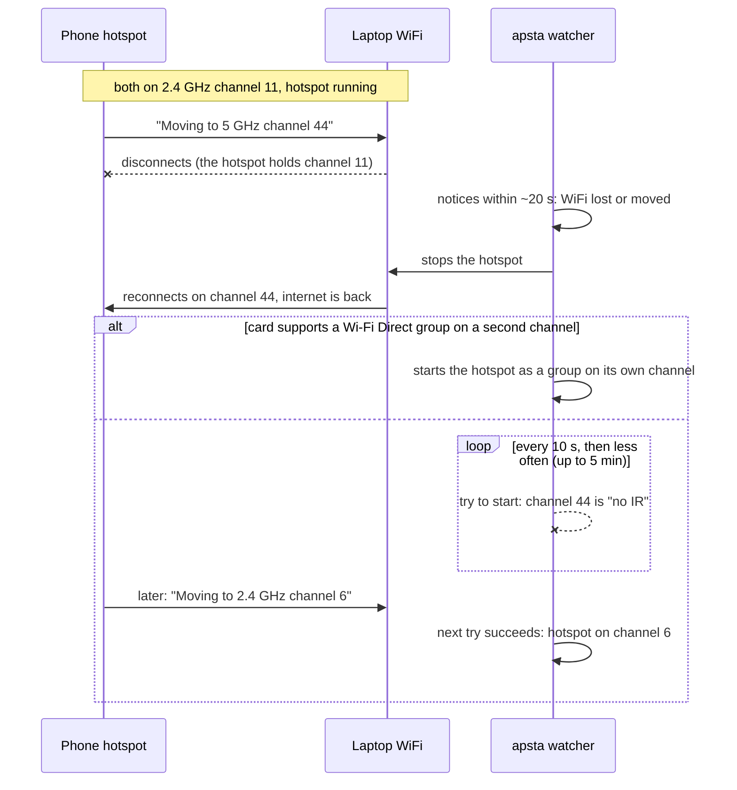

# Hotspot won't start while your WiFi is on 5 GHz

You're connected to a 5 GHz network and `apsta start` refuses:

```
Your WiFi is connected on 5 GHz channel 44, where this card isn't allowed to
start a network (marked "no IR" by its firmware/regulatory rules). It can only
run the hotspot on the same channel as your WiFi.
```

On older versions you saw driver errors instead, such as hostapd *"not
broadcasting"* or NetworkManager's *"No suitable device found"*.

The same laptop may have worked fine yesterday. What changed is the network
you're connected to, not apsta.

> **Newer apsta handles this on most Intel cards.** If `apsta detect` shows
> *"Wi-Fi Direct group on its own channel: yes"*, apsta no longer refuses: the
> hotspot runs as a Wi-Fi Direct group on a channel of its own, the way
> Windows' Mobile Hotspot does (see [the Wi-Fi Direct fallback](#the-wi-fi-direct-fallback)).
> The same goes for networks on radar (DFS) channels 52–144, common on campus
> and office networks. The rest of this page is about cards that can't do
> that, and the fixes for them.

## Why it happens

Two rules of your WiFi card combine.

**1. The hotspot must use the same channel as your WiFi.**
Most laptop cards (Intel, Realtek, most MediaTek) have one radio. To be
connected to WiFi *and* run a hotspot at the same time, both have to sit on
one channel. If your WiFi is on channel 44, the hotspot has to be on 44 too.
`apsta detect` shows this as *"The hotspot will use the same channel as your
WiFi connection."*

**2. The card may not be allowed to start a network on that channel.**
Radio rules differ by country. To stay within them without knowing where it
is, the card's firmware lets it *join* networks on many 5 GHz channels but
only *start* one on a few. Channels where it can only join are marked
**"no IR"** (no "initiating radiation"). On Intel cards that's typically 5 GHz
channels 36–144; channels 149–165 and all 2.4 GHz channels are usually
allowed.

Put together:



The firmware enforces this, and apsta doesn't override it. On Intel cards the
firmware is often stricter than the law where you are; see
[fix 4](#fixes) if you want to change that yourself.

Common situations:

- **Phone hotspot as your internet.** Many phones (Xiaomi/Redmi, Samsung,
  Pixel) run their hotspot on 5 GHz, and some switch bands on their own. That
  is why it can work one day and not the next.
- **Dual-band router** with one name for both bands. Your laptop picks 5 GHz
  when the signal is good.

## Check whether you're affected

```sh
apsta detect
```

shows a warning and a "Hotspot on 5 GHz" row:

```
✔  Your card can run a hotspot while staying connected to WiFi.
⚠  Your WiFi is on 5 GHz channel 44, where this card can't host.
⚠  Switch that network to 2.4 GHz, or connect to a 2.4 GHz network, then start.
⚠  Why: https://github.com/krotrn/apsta/blob/main/docs/5ghz-wifi.md
```

The raw data: `iw dev` shows your WiFi channel, and
`iw phy phy0 info` lists every channel. The ones marked `(no IR)`,
`(radar detection)` or `(disabled)` can't host.

No warning doesn't mean you're safe for good: a network that switches bands
by itself can be on 2.4 GHz now and on 5 GHz in an hour. See the next section.

## When the network switches band while the hotspot is running

Phone hotspots set to an automatic band (often the default) move between
2.4 and 5 GHz by themselves, without you touching anything. Your laptop
follows, because it has to stay on the phone's channel. You can see it in
the system log:

```sh
journalctl -k | grep "switches to different band"
```

```
wlo1: AP aa:bb:cc:dd:ee:ff switches to different band (5220 MHz, ...), disconnecting
```

If it moves to a channel your card can't host on, the hotspot can't keep
running there. Worse, while the hotspot holds the old channel your laptop
can't follow the phone either, so you'd have no internet at all. apsta
watches for this and steps aside:



The watcher runs however you start the hotspot: with `sudo apsta start` or
the GUI it runs in the background as `apsta-watch.service`; with
`sudo apsta enable` (or `sudo apsta run` in a terminal) the service itself
does it. `sudo apsta stop` stops the watcher too. To see what it's doing:

```sh
journalctl -u apsta-watch    # started with apsta start or the GUI
journalctl -u apsta          # started with apsta enable
```

On cards without the Wi-Fi Direct fallback, while the network stays on such
a channel you get internet but no hotspot. The lasting fix is to stop the network from switching: set its band to
2.4 GHz explicitly (below).

On systems without systemd, a hotspot started with `apsta start` isn't
watched: run `sudo apsta stop` to get your WiFi back, or use
`sudo apsta enable`.

## Fixes

Pick whichever suits you:

1. **Move your WiFi to 2.4 GHz.** Simplest, keeps everything else the same.
   - Phone hotspot: *Settings → Hotspot → AP band → 2.4 GHz* (the wording
     varies; on Xiaomi/Redmi: *Connection & sharing → Portable hotspot → Set
     up portable hotspot → AP band*). Pick 2.4 GHz explicitly: "auto" or
     "5 GHz preferred" can switch back to 5 GHz at any time.
   - Router: connect to its 2.4 GHz network. If both bands share a name, many
     routers let you split them in their settings.

   Then reconnect and run `sudo apsta start`.

2. **Get internet another way, then let apsta drop WiFi.** For example, plug
   the phone in with USB and turn on *USB tethering*, or use ethernet. Then:

   ```sh
   sudo apsta start --allow-disconnect
   ```

   apsta disconnects the WiFi and hosts on a channel the card allows (for
   example 5 GHz channel 149, which is fast). Internet comes over the cable.

3. **Use a USB WiFi adapter for the hotspot.** It has its own radio, so your
   built-in card can stay on any channel:

   ```sh
   sudo apsta start --interface wlan1
   ```

   `apsta recommend` lists adapters with in-kernel Linux drivers.

4. **Intel cards: let the kernel decide (advanced).** Intel cards keep their
   own copy of the radio rules in firmware (*LAR*, location-aware regulatory)
   and are often stricter than the law. For example, India allows hosting on
   5 GHz channels 36–48, but an Intel AX201 still marks them "no IR":

   ```sh
   iw reg get          # "global" = the kernel's rules, "phy#0 (self-managed)" = the firmware's
   ```

   ```
   global
   country IN: DFS-UNSET
   	(5150 - 5250 @ 80), (N/A, 30), (N/A)        ← channels 36–48: allowed, no radar rules
   phy#0 (self-managed)
   	* 5220.0 MHz [44] (22.0 dBm) (no IR)         ← the firmware says no
   ```

   If the kernel's rules for your country allow a channel the firmware
   blocks, a patched driver can hand the decision back to the kernel. The
   iwlwifi driver used to have a `lar_disable=1` option for this; it was
   removed. The
   [linux-wifi-hotspot project](https://github.com/lakinduakash/linux-wifi-hotspot/blob/master/docs/howto/intel-5ghz-lar.md)
   keeps a patch and scripts that restore it. Follow their guide; in short:

   ```sh
   lsmod | grep -E '^iwl(dvm|mvm|mld)'   # must say iwlmvm (AX2xx and older); iwlmld is not supported
   cd util/iwlwifi-lar-disable && ./build.sh
   sudo COUNTRY=IN ./install.sh          # your own two-letter country code
   sudo reboot
   ```

   Afterwards `iw phy phy0 info` shows no "(no IR)" on the channels your
   country allows, and `sudo apsta start` works on them with no other change.

   Before you do this:

   - **You become responsible for the radio rules.** Set the country you are
     actually in. The patch doesn't grant spectrum, it only stops the
     firmware being more careful than the law.
   - **It replaces a kernel module.** It has to be rebuilt after every kernel
     update (on rolling distributions such as Arch, that's often), and with
     Secure Boot on you must enroll a signing key first.
   - **Radar channels (52–144) stay off-limits.** Hosting there needs radar
     detection, which client cards don't do.
   - apsta doesn't ship or run this patch; it's a change to your system's
     driver, so it stays your decision.

## The Wi-Fi Direct fallback

Many cards that pin a normal hotspot to the WiFi's channel can run a *Wi-Fi
Direct group owner* on a second one (most Intel cards). When the WiFi's
channel can't host, apsta starts one through NetworkManager's wpa_supplicant
(method `p2p`) on a channel the card allows, with your usual name and
password. The radio switches between the two channels, so the hotspot and
your WiFi share its speed; that's why apsta still prefers the same channel
whenever it works.

[wifi-direct.md](wifi-direct.md) explains which cards and distributions
support it, the trade-offs, and how it works.

## What apsta doesn't work around

- **Hosting on the "no IR" channel anyway**: the firmware refuses. Where the
  firmware is stricter than the law, the fix is in the driver
  ([fix 4](#fixes)), not something a
  hotspot tool should do behind your back. The kernel's "IR-concurrent"
  exception (hosting on a no-IR channel you are already connected on) applies
  only to Wi-Fi Direct groups, not to a normal hotspot, and distributions
  don't enable it.
- **Cards without a second channel for Wi-Fi Direct**: there is no other
  way to keep WiFi and host elsewhere.

So on those cards apsta tells you up front and suggests the fixes above,
instead of trying and failing with driver errors.
