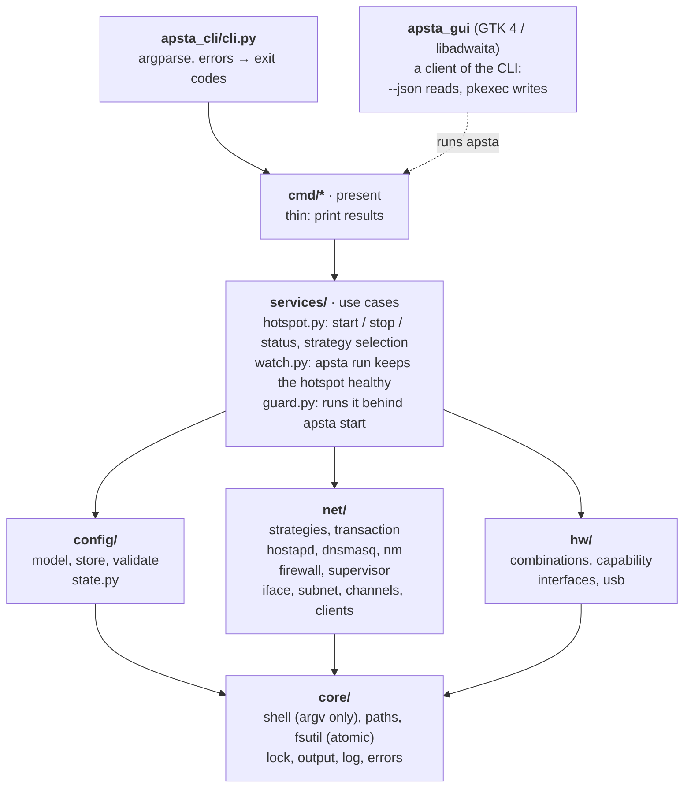
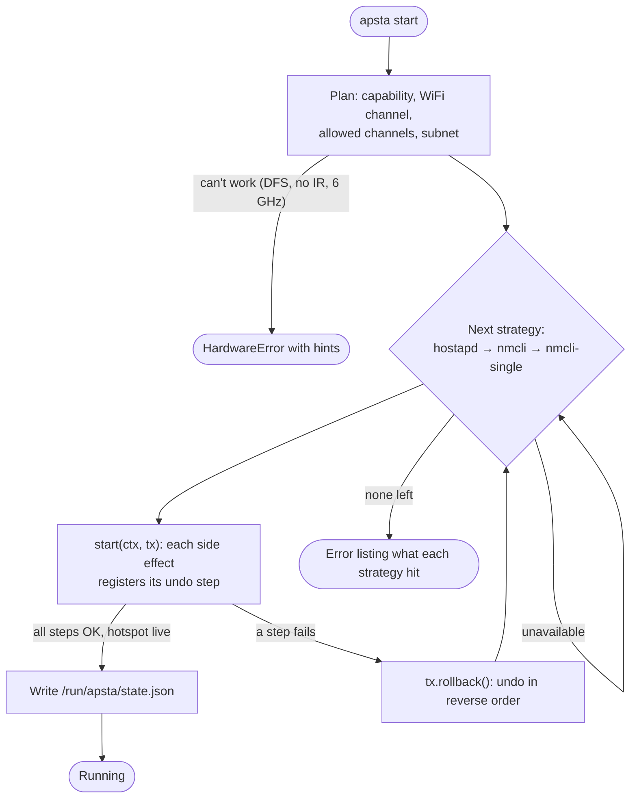
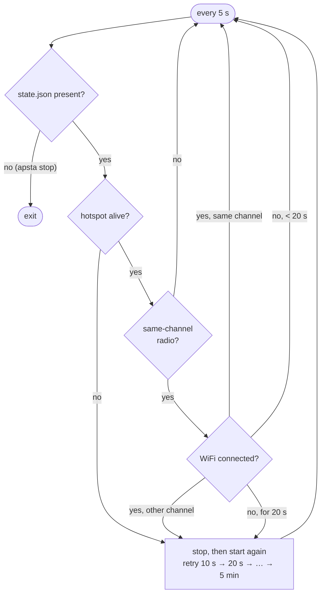
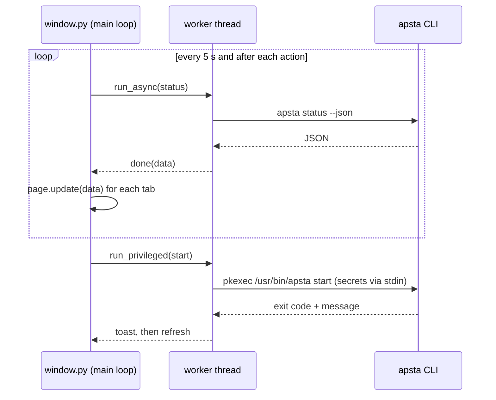

# Architecture

This document describes how apsta is put together and why. Read it before a
non-trivial change.

## Layers



Dependencies only point downwards. `core` imports nothing from apsta.
`hw`, `net` and `config` don't print user-facing guidance; they raise
`ApstaError` subclasses that carry `hints`, and `cli.py` renders them and maps
them to exit codes.

## Key decisions

### Hardware capability comes from interface combinations

`hw/combinations.py` parses `iw phy <phy> info` into `Combination(groups,
total, channels)` and asks one question: can one `AP` and one `managed`
interface exist at the same time? That means placing each requested
interface into a group with spare capacity, within `total`. `#channels <= 1`
means the AP must share the STA's channel. Earlier versions guessed from
whether AP and managed appeared in the same `#{}` group, which was wrong in
both directions. Real driver outputs live in `tests/fixtures/iw/`.

### Strategies + transactions

`net/strategies.py` holds three implementations of one interface
(`unavailable`, `start(ctx, tx)`, `stop(state)`): `hostapd`, `nmcli`
(virtual interface) and `nmcli-single`. `services/hotspot.start` tries them
in order. Each `start` registers an undo step with the `Transaction` after
every side effect, so a failure part-way rolls back to a clean system before
the next strategy is tried.



`nmcli-single` drops the WiFi connection, so while connected it is only tried
with `--allow-disconnect`.

### Runtime state lives in /run

`state.py` writes `HotspotState` to `/run/apsta/state.json` once the hotspot
is fully up, with everything `stop` needs: interface names, subnet, firewall
backend and its undo data, the previous `ip_forward` value, client limits.
`/run` is a tmpfs, so a crash or reboot can't leave a stale "running" record.
On start, a recorded hotspot that is no longer alive is cleaned up first.
Configuration (`/etc/apsta/config.json`, world-readable) and secrets
(`/etc/apsta/secrets.json`, 0600) are separate and written atomically.

### Processes are supervised

`net/supervisor.py` runs hostapd and dnsmasq as transient systemd units
(`apsta-hostapd.service`, `apsta-dnsmasq.service`, `Restart=on-failure`,
logs in the journal). On non-systemd systems it falls back to pidfiles, and
checks a pid against `/proc/<pid>/cmdline` before signalling it.

### The service watches, not just starts

`apsta.service` runs `apsta run --wait-sta 30`. A one-off `apsta start`
(and so the GUI) launches the same watcher as the transient unit
`apsta-watch.service` (`services/guard.py`, systemd only), which adopts the
hotspot that is already up; `apsta stop` stops the watcher before the
hotspot. `services/watch.py` polls every 5 s and `decide()` (a pure function)
restarts the hotspot when:

- it went down (resume from suspend, driver reset, hostapd gave up);
- on single-channel radios, the WiFi connection moved to another channel;
- on single-channel radios, the WiFi connection has been gone for 20 s.
  The AP may be what stops NetworkManager reconnecting on another channel.



If the WiFi moved to a channel the card can't host on, every retry fails
with the "no IR" error until the network moves back; see
[5ghz-wifi.md](5ghz-wifi.md).

### Firewall backends record their own undo data

`net/firewall.py` chooses firewalld (if running), then iptables, then
nftables. Each backend's `apply` returns data its `revert` uses, so teardown
only removes what apsta added. For example, masquerading is removed only from
zones where apsta enabled it.

### No shell, no secrets in argv

`core/shell.run` takes argv lists only (no `shell=True` anywhere). Passwords
travel through files: hostapd.conf (0600), NetworkManager keyfiles in
`/run/NetworkManager/system-connections` (0600), and stdin
(`--password-stdin`), never command-line arguments that other users can read
in `ps`.

### The CLI's JSON output is an interface

`status`, `detect`, `config`, `clients` and `start` accept `--json`. The GUI is
built on that output and scripts may be too, so treat its keys as a public
interface: add keys freely, but don't rename or remove them without a
changelog entry. The keys are documented in [json-output.md](json-output.md).

## The GUI

`apsta_gui` is a GTK 4 / libadwaita application, and a *client of the CLI*.
It never imports `apsta_cli` logic (only its version string). That gives one
implementation of every operation, one privilege boundary, and a GUI that
can't put the system into states the CLI can't explain.

```
app.py        Adw.Application: actions (refresh, about, quit), shortcuts,
              startup fixes (bundled icons, missing font DPI)
window.py     main window: header, tabs, toasts, busy spinner, 5 s refresh loop,
              run_async / run_privileged helpers used by every page
pages/        one class per tab, each builds its widgets and exposes update(data)
  hotspot.py    status hero + start/stop, connection details, profile switcher
  clients.py    device rows with a menu (speed limit, disconnect, block), blocked list
  settings.py   network settings, profiles, start at boot, hardware report
share.py      Share dialog (QR code + password)
compat.py     newest libadwaita widget when available, fallback otherwise
backend.py    runs `apsta … --json` and `pkexec apsta …` (no GTK, unit-tested)
helpers.py    pure formatting / text logic (no GTK, unit-tested)
```

**Data flow.** Every 5 seconds (and after every action) the window runs
`apsta status --json` in a worker thread and hands the result to each page's
`update(data)` on the main loop. `apsta detect --json` runs once at startup.
Pages never block the main loop: subprocesses always run through
`window.run_async(work, done)`, and widgets are touched only in `done`.



**Changes** go through `window.run_privileged(work)`. It shows the spinner,
runs `pkexec /usr/bin/apsta <args>` in a thread, shows the outcome as a toast
and refreshes. Only one privileged action runs at a time. Secrets (new
passwords, the password fetched for Share) travel over stdin and stdout,
never argv. The polkit action `com.github.apsta.manage` (`auth_admin_keep`)
names apsta in the prompt and remembers authentication for a few minutes.

**Rules the pages follow:**

- Periodic refreshes must not overwrite a field the user is editing. Pages
  remember the last value they wrote and update a field only if it still
  holds that value.
- Device rows are kept per MAC across refreshes, so an open menu isn't
  destroyed by the 5-second update.
- Everything user-controlled (SSIDs, hostnames) passes through `compat.esc()`
  before reaching a row title, subtitle, toast or status page, because those
  are Pango markup.

**Supporting old and new libadwaita.** Distros ship very different versions
(1.1 on Ubuntu 22.04, 1.5 on 24.04, the latest on Arch/Fedora). The GUI uses
the newest widgets available and falls back on older systems, entirely inside
`compat.py`:

| Need                  | ≥ this libadwaita                        | Fallback                    |
| --------------------- | ---------------------------------------- | --------------------------- |
| window layout         | ToolbarView (1.4)                        | Gtk.Box                     |
| tabs                  | header + bottom bar via Breakpoint (1.4) | compact header switcher     |
| text fields           | EntryRow / PasswordEntryRow (1.2)        | ActionRow + Gtk.Entry       |
| toggles               | SwitchRow (1.4)                          | ActionRow + Gtk.Switch      |
| action rows           | ButtonRow (1.6)                          | ActionRow + Gtk.Button      |
| busy indicator        | Adw.Spinner (1.6)                        | Gtk.Spinner                 |
| dialogs               | Adw.Dialog (1.5, sheet on narrow)        | modal Adw.Window            |
| about                 | AboutDialog (1.5) / AboutWindow (1.2)    | Gtk.AboutDialog             |

Outside `compat.py` only libadwaita 1.1 / GTK 4.6 API is allowed;
`tests/unit/test_gui.py` fails otherwise. `compat.ensure_font_dpi()` works
around libadwaita 1.5 collapsing page width when the session provides no
font DPI.

Because GTK 4 and libadwaita 1 keep their API stable within the major
version (deprecations warn, nothing is removed) and the app pins
`Gtk 4.0`/`Adw 1` via `gi.require_version`, library updates don't break it.
CI runs the GUI on the newest releases (Arch, Fedora) to catch problems early.

## Extending

| Task                     | Where                                                                      |
| ------------------------ | -------------------------------------------------------------------------- |
| New hotspot method       | subclass `Strategy` in `net/strategies.py`, add to `STRATEGIES`             |
| New firewall             | class with `name/apply/revert` in `net/firewall.py`, register in `detect()` |
| New init system          | `ENABLE`/`DISABLE` in `cmd/service.py` + a file in `apsta_cli/data/`        |
| New USB chipset          | `USB_CHIPSET_DB` in `hw/usb.py`                                             |
| Card detected wrongly    | add its `iw phy` output to `tests/fixtures/iw/` with a test                 |
| New command              | parser in `cli.py`, handler in `cmd/`, logic in `services/`                 |
| GUI: new tab             | class in `apsta_gui/pages/` with `widget` + `update(data, detect)`; register in `window.py` |
| GUI: widget newer than libadwaita 1.1 | add a helper with a fallback to `apsta_gui/compat.py` |
| GUI: new action          | a `backend.py` method calling the CLI + `window.run_privileged(...)` |

Shell completion is generated from the argparse tree, so new commands and
flags are completable without extra work.

## Testing

- `tests/unit/`: pure functions and modules with `FakeShell` (a scriptable
  stand-in for `core.shell.run`) and isolated paths (`tests/support.py`).
- `tests/integration/`: the real CLI, in-process, against a simulated
  network stack (`fakeworld.py`). That is fake `iw`, `ip`, `nmcli`, `hostapd`,
  `dnsmasq`, `iptables`, … executables that share state in a JSON file and a
  fake sysfs. These tests cover full start → clients → stop lifecycles,
  fallback with rollback, stale-state recovery, DFS refusal and more, with no
  root and no hardware.

- `tests/unit/test_gui.py`: the GUI's non-GTK parts (`backend.py`,
  `helpers.py`) and a portability check that GTK code outside `compat.py`
  uses only libadwaita 1.1 API.
- `scripts/gui_smoke.py`: builds every GUI state (on, empty, off, single-radio
  card, CLI unavailable, narrow window, dialogs) against a fake backend on a
  headless display (Broadway, or Xvfb where GTK lacks Broadway), with GTK
  criticals made fatal. It saves a screenshot of each view. CI runs it on
  Ubuntu 22.04, Debian 12, Ubuntu 24.04, Fedora and Arch.

Run `make test`, `make coverage` or `make gui-smoke`. CI enforces ≥ 94 %
coverage of `apsta_cli` and the GUI's non-GTK modules. GTK widget code is
covered by the smoke test instead.
