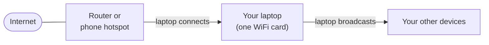
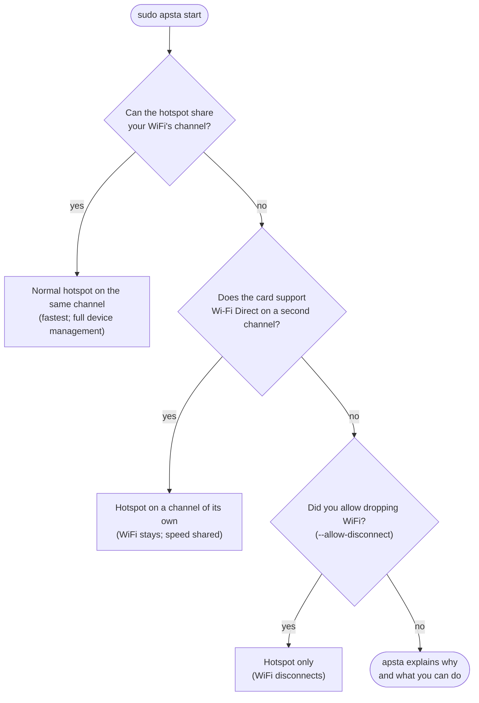

# How apsta works, in plain language

This page explains what apsta does, why sharing WiFi from a laptop is
harder than it looks, which problems you may run into, and how apsta deals
with each one. No networking background needed. For the technical design,
see [ARCHITECTURE.md](ARCHITECTURE.md).

## What apsta does

Your laptop has one WiFi card. Normally it does one job: it **connects** to a
network, such as your router, your phone's hotspot or a campus network.

apsta gives it a second job at the same time: **broadcasting** a network of
its own, so your phone, tablet or another laptop can join it and share the
laptop's internet.



Plain Linux tools (`nmcli device wifi hotspot`) do the second job by giving up
the first: your WiFi disconnects. apsta keeps both running.

## The one rule behind almost every problem

WiFi is split into **channels**, a bit like radio stations. Your router uses
one channel, your neighbour's another.

Most laptop cards have **one radio**, so they can only be on one channel at a
time. To connect and broadcast at once, **the hotspot must use the same
channel your WiFi is connected on**. Connected on channel 6? The hotspot is on
channel 6 too.

`apsta detect` tells you whether your card works this way:

```
✔  AP + STA at the same time            yes      ← it can connect and broadcast
✘  AP on a different channel than STA   no       ← but only on one channel
```

Most of the problems below come from this rule.

## Problems you may run into, and what apsta does about them

### 1. Some channels don't allow broadcasting

Not every channel lets a laptop start a network, even if it can connect there:

| Channels | Why a laptop can't broadcast there | Where you meet it |
| -------- | ---------------------------------- | ----------------- |
| 5 GHz 52–144 ("DFS") | Weather and airport radar also use them. Only devices that listen for radar may broadcast, and laptop cards can't. This rule applies in most countries. | Campus, office and hotel networks |
| Some other 5 GHz channels ("no IR") | The card's firmware only allows *joining* networks there. Intel cards often block 5 GHz channels 36–48 like this. | Phone hotspots on 5 GHz |
| 6 GHz | Linux doesn't allow laptops to broadcast there. | Wi-Fi 6E routers |

Combined with the one-channel rule, this used to mean **no hotspot at all**
while connected to such a network. The only fix was to move your network to
2.4 GHz, for example by setting your phone's hotspot band to 2.4 GHz.

**What apsta does now:** it gives the hotspot a channel of its own (see
["Wi-Fi Direct" below](#how-apsta-gets-around-the-one-channel-rule)). On cards
that can't do that, it explains the problem up front and lists your options,
instead of failing with a confusing driver error. [5ghz-wifi.md](5ghz-wifi.md)
has the details and the manual fixes.

### 2. Your network changes channel while the hotspot runs

Phone hotspots set to an automatic band often move between 2.4 and 5 GHz by
themselves. Routers sometimes change channel too. Your laptop wants to follow,
but with the one-channel rule the running hotspot holds it on the old channel,
so you could lose internet until you stopped the hotspot by hand.

**What apsta does:** a small background watcher keeps an eye on this. When
your WiFi is lost or moves, it stops the hotspot, lets the WiFi reconnect, and
starts the hotspot again on the new channel, or on a channel of its own if the
new one can't host. Devices on the hotspot drop for about 20–30 seconds and
reconnect by themselves, because the name and password stay the same.

It runs however you start the hotspot (`apsta start`, the app, or at boot).
`journalctl -u apsta-watch` shows what it does.

### 3. Why Windows doesn't have these problems

Windows' *Mobile Hotspot* doesn't use a normal hotspot. It uses **Wi-Fi
Direct**, which many cards (including most Intel ones) can run **on a second
channel**: the radio switches between the two channels many times a second.
apsta now does the same, as the next section explains.

## How apsta gets around the one-channel rule

When your WiFi's channel can't host a hotspot, apsta starts the hotspot as a
**Wi-Fi Direct group on a channel of its own**, usually on 2.4 GHz.

```
Interface p2p-wlo1-0   channel 6    (2.4 GHz)   ← your hotspot
Interface wlo1         channel 128  (5 GHz)     ← your WiFi stays where it is
```

Your devices don't need to know anything about Wi-Fi Direct: they see a
normal network with your usual name and password, and join it the usual way
(or scan `apsta qr`).

The trade-off: one radio now serves two channels, so **the hotspot and your
own WiFi share its speed**, each getting roughly half. That's why apsta only
uses this when the normal, same-channel hotspot can't work. You can also ask
for it directly with `sudo apsta start --method p2p`. Then the hotspot never
has to move when your WiFi does.

It needs a card that supports it (`apsta detect` shows *"Wi-Fi Direct group
on its own channel: yes"*) and NetworkManager's wpa_supplicant. On Fedora,
openSUSE, Alpine and Void it also needs a small Python library, `jeepney`.
[wifi-direct.md](wifi-direct.md) lists which cards and distributions work.

## What happens when you press Start



Whichever way it starts, apsta also:

- **hands out addresses** to devices that join (DHCP) and **shares your
  internet** with them (NAT), working with your firewall;
- **creates a random password** the first time, and never puts it on a
  command line where other users could see it;
- **cleans up completely** on `apsta stop`, even if starting failed half-way:
  every step it takes knows how to undo itself;
- **keeps the hotspot healthy**: the watcher also brings it back after
  suspend/resume or a driver hiccup.

## You choose; apsta explains

Everything apsta decides on its own can be set instead, in `apsta config` or
the app's Settings:

- **Method**: automatic, or force one (for example Wi-Fi Direct, so the
  hotspot always uses your band and channel).
- **Band and channel**: `auto` picks the least crowded channel; a number
  picks that channel.

Some things can't be overridden: radar channels, channels the card's firmware
forbids, and the one-channel rule of a normal hotspot. When a setting can't
be followed, apsta doesn't ignore it silently. `apsta start`, `apsta status`
and the app's **Why it runs this way** section explain what it chose and why,
for example:

```
Your band setting is 5 GHz, but the hotspot is on 2.4 GHz because it shares
your WiFi's channel. To always use your band, set method to p2p (Wi-Fi Direct;
shares the radio's speed).
```

The same notes go to `/var/log/apsta.log`.

## Things that still have limits

- **Speed in Wi-Fi Direct mode** is shared between the hotspot and your WiFi.
- **The Wi-Fi Direct hotspot is usually on 2.4 GHz**, because many cards
  (Intel included) aren't allowed to start a network on most 5 GHz channels.
- **Devices that only have 2.4 GHz** (older phones, smart TVs, printers, smart
  plugs) can't see a hotspot on 5 GHz. With the normal hotspot, the band is
  whatever your WiFi uses; apsta tells you when that differs from your `band`
  setting, and `method=p2p` keeps the hotspot on your band.
- **Letting only your own devices join, and blocking devices**, need the
  normal hotspot with hostapd installed. They aren't available in Wi-Fi Direct
  mode, and apsta won't start a hotspot that would ignore your allowlist.
- **Cards that can't run Wi-Fi Direct on a second channel** still hit
  problem 1. A USB WiFi adapter gives you a second radio; `apsta recommend`
  lists ones with good Linux drivers.

## Quick reference

| You see | What it means | What to do |
| ------- | ------------- | ---------- |
| "DFS channel …" | Your network is on a radar channel | Nothing on cards with Wi-Fi Direct; otherwise use a 2.4 GHz network or `--allow-disconnect` |
| "marked no IR" | Your card can't broadcast on that 5 GHz channel | Same as above, or set your phone hotspot to 2.4 GHz |
| Hotspot briefly drops, then returns | Your WiFi moved channel and the watcher followed | Nothing; set your network's band explicitly to avoid it |
| `p2p` "needs python3-jeepney" in `apsta detect` | Your distribution needs one small library for Wi-Fi Direct | Install `python3-jeepney` (or your distribution's name for it) |
| Hotspot slower than expected | Wi-Fi Direct mode is sharing the radio | Connect to a network on a channel your card can host on |

More help: [README troubleshooting](../README.md#troubleshooting),
[5ghz-wifi.md](5ghz-wifi.md), [wifi-direct.md](wifi-direct.md).
