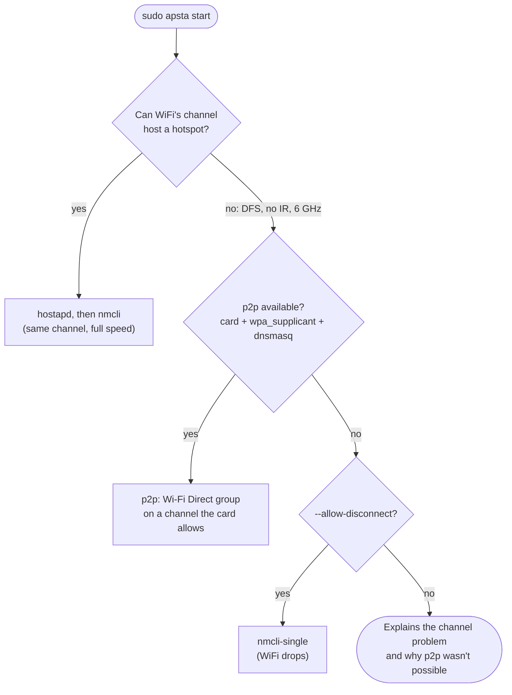

# Wi-Fi Direct hotspots (method `p2p`)

This page explains how apsta keeps a hotspot running when your WiFi is on a
channel the card can't host on, which distributions and cards support it, and
how the code works. It is meant for users who want to know whether it works
on their machine, and for contributors who want to change or extend it.

## The problem

Most laptop WiFi cards have one radio. They can be connected to a network
("station", STA) and run a hotspot ("access point", AP) at the same time, but
the driver only allows that **on one channel**. The hotspot has to use
whatever channel your WiFi connection is on.

Some channels can't host a hotspot:

| Channel | Why it can't host | Typical example |
| ------- | ----------------- | --------------- |
| 5 GHz 52–144 (DFS) | Radar may use them; an AP must listen for radar first, which client cards can't do | Campus and office networks |
| 5 GHz channels marked "no IR" | The card's firmware only allows *joining* networks there (Intel: often 36–48 too) | A phone hotspot on 5 GHz |
| 6 GHz | Linux drivers don't allow AP mode there | Wi-Fi 6E routers |

When your WiFi is on one of those, a one-channel hotspot is impossible.
Before this feature apsta could only explain why and suggest switching
networks; [5ghz-wifi.md](5ghz-wifi.md) has the details.

## The solution: a channel of its own

Many of those cards allow a second kind of interface on a **different**
channel: a *Wi-Fi Direct group owner* (P2P-GO). The radio switches between the
two channels many times a second. Windows' Mobile Hotspot works this way,
which is why it doesn't have the problem.

To phones and laptops a group owner looks like a normal WPA2 network: they
see its name, type the password (or scan `apsta qr`) and get an address. They
don't need to support Wi-Fi Direct.

```
$ iw dev | grep -E 'Interface|ssid|channel'
        Interface p2p-wlo1-0
                ssid apsta-hotspot
                channel 6 (2437 MHz), width: 20 MHz       ← the hotspot
        Interface wlo1
                ssid NIT-Student
                channel 128 (5640 MHz), width: 40 MHz     ← WiFi stays on a DFS channel
```

## Does it work on my machine?

Run `apsta detect`. With support you'll see:

```
     ✔  Wi-Fi Direct group on its own channel   yes
...
Methods
     p2p      ready
```

Three things have to be true. `apsta detect` checks all of them.

### 1. The card and driver

The driver must allow a P2P-GO beside a station on two channels. You can check
by hand: `iw list` (or `iw phy phy0 info`) must show a combination with
`P2P-GO` and `#channels <= 2`:

```
valid interface combinations:
     * #{ managed } <= 1, #{ P2P-client, P2P-GO } <= 1, #{ P2P-device } <= 1,
       total <= 3, #channels <= 2                       ← this one
     * #{ managed } <= 1, #{ AP, P2P-client, P2P-GO } <= 1, #{ P2P-device } <= 1,
       total <= 3, #channels <= 1                       ← a normal AP: one channel only
```

| Hardware | Status |
| -------- | ------ |
| Intel AX201 (driver `iwlmvm`) | **Tested**: works (Arch, kernel 7.2) |
| Other Intel Wi-Fi 5/6/6E cards using `iwlmvm` (7260 … AX211) | Expected to work: same driver, same combination |
| Intel Wi-Fi 7 (`iwlmld`), Realtek, MediaTek, Qualcomm | Unknown. Please report `apsta detect --json` |

### 2. wpa_supplicant with Wi-Fi Direct

NetworkManager uses wpa_supplicant for WiFi, and apsta asks that same
wpa_supplicant to create the group. apsta can reach it in two ways (details
[below](#two-ways-to-reach-wpa_supplicant)):

- the **control socket** `/run/wpa_supplicant/p2p-dev-<interface>`, which
  exists when wpa_supplicant is started with `-O /run/wpa_supplicant`;
- **D-Bus**, which works everywhere NetworkManager does, but needs the
  Python library `jeepney`.

What each distribution ships (checked against their packages, October 2026):

| Distribution | wpa_supplicant | NetworkManager | Control socket | D-Bus (with jeepney) |
| ------------ | -------------- | -------------- | -------------- | -------------------- |
| Arch, Manjaro, EndeavourOS | 2.12 | 1.58 | ✅ | ✅ |
| Ubuntu 22.04 (Mint 21, Pop!_OS 22.04) | 2.10 | 1.36 | ✅ | ✅ |
| Ubuntu 24.04, 25.04 (Mint 22) | 2.10 | 1.46, 1.52 | ✅ | ✅ |
| Debian 12, 13 | 2.10 | 1.42, 1.52 | ✅ | ✅ |
| Fedora 41, 42 | 2.11 | 1.50, 1.52 | ✘ (no `-O`) | ✅ |
| openSUSE Leap 15.6, Tumbleweed | 2.10, 2.12 | 1.44, 1.58 | ✘ (no `-O`) | ✅ |
| Alpine 3.24 | 2.11 | 1.52 | ✘ (D-Bus only) | ✅ |
| Void | 2.12 | 1.56 | ✘ (D-Bus only) | ✅ |

Every one of them builds wpa_supplicant with Wi-Fi Direct (`CONFIG_P2P`).
Only Arch is tested on real hardware. The other rows come from the packaged
service files and binaries.

**It can't work** when NetworkManager uses **iwd** instead of wpa_supplicant
(`wifi.backend=iwd`): there is no wpa_supplicant to ask. Gentoo needs
wpa_supplicant built with `USE=p2p`. NixOS hasn't been checked.

jeepney 0.7 or newer works (tested with 0.7.1 and 0.9.0). Every
distribution above packages it:

| Distribution | Package | Version |
| ------------ | ------- | ------- |
| Fedora 41, 42 | `python3-jeepney` | 0.8.0 |
| openSUSE Tumbleweed | `python313-jeepney` | 0.9.0 |
| openSUSE Leap 15.6 | `python311-jeepney` (apsta needs Python ≥ 3.10; `python3-jeepney` is for Python 3.6) | 0.8.0 |
| Alpine 3.24 | `py3-jeepney` | 0.9.0 |
| Void | `python3-jeepney` | 0.9.0 |
| Ubuntu 22.04, 24.04 | `python3-jeepney` | 0.7.1, 0.8.0 |
| Debian 12, 13 | `python3-jeepney` | 0.8.0, 0.9.0 |
| Arch | `python-jeepney` | 0.9.0 |

apsta's packages pull it in where they can: the `.deb` recommends
`python3-jeepney`, Arch lists `python-jeepney` as optional, and with pip it's
`pip install "apsta[p2p]"`. On Debian, Ubuntu and Arch the control socket
already works, so jeepney is only a fallback there.

### 3. dnsmasq

The group only carries WiFi frames. apsta hands out addresses with dnsmasq
and shares your connection with NAT, exactly as in hostapd mode. Install
`dnsmasq` (most packages recommend it).

## When apsta uses it

The other methods are tried first. A hotspot on the WiFi's own channel uses
the radio fully, so it's faster when it works.



You can also ask for it directly: `sudo apsta start --method p2p`. Then the
group starts on the WiFi's channel when that channel allows it (full speed),
and simply stays there if the WiFi moves later.

The channel for the group comes from the same planner as hostapd mode: your
`band` setting, the least crowded of 1/6/11 (2.4 GHz) or 36–48 (5 GHz), and
only channels the card may start a network on. On Intel cards in many
countries that means 2.4 GHz.

Once it runs, the [watcher](5ghz-wifi.md#when-the-network-switches-band-while-the-hotspot-is-running)
only checks that the group is still alive. It doesn't restart the hotspot when
your WiFi changes channel, because the group never had to follow it.

## Trade-offs

- **Speed is shared.** While the two channels differ, the radio splits its
  time between them. Expect roughly half the throughput on each side and a
  few extra milliseconds of latency.
- **No allowlist or blocking.** `allowed_macs` and `apsta clients disconnect
  --block` use hostapd's access-list commands, which apsta doesn't have for
  a wpa_supplicant group. Listing and kicking clients work. With `allowed_macs` set,
  apsta won't use `p2p`: it never runs a hotspot that ignores your allowlist.
- **Hidden networks** (`hidden=yes`) set `ignore_broadcast_ssid` on the group
  but haven't been tested on hardware yet.

## How it works

### The steps

```mermaid
sequenceDiagram
    participant A as apsta
    participant W as wpa_supplicant (NetworkManager's)
    participant K as kernel / driver
    A->>W: add a persistent group network<br/>(name, password, mode = group owner)
    W-->>A: network id / object path
    A->>W: start the group from it on 2437 MHz
    W->>K: create p2p-wlo1-0, start beaconing
    A->>K: poll `iw dev` until a new P2P-GO interface has an SSID
    A->>K: address, dnsmasq, NAT (same code as hostapd mode)
    Note over A,K: hotspot running; state saved in /run/apsta/state.json
    A->>W: stop: remove the group, forget the network<br/>and wpa_supplicant's copy of it
```

Why a *persistent* group? A plain `P2P_GROUP_ADD` invents its own name
(`DIRECT-xy`) and password. A persistent group is started from a network
block that apsta writes, so it can use your hotspot's name and password:

| Setting | Value | Meaning |
| ------- | ----- | ------- |
| `ssid` | your name, hex-encoded | any characters, no escaping |
| `psk` | your password (quoted), or a raw 64-hex key | WPA2 passphrase |
| `key_mgmt`, `proto`, `pairwise` | `WPA-PSK`, `RSN`, `CCMP` | WPA2-Personal with AES |
| `mode` | `3` | group owner (`0` would make wpa_supplicant *join* the group) |
| `disabled` | `2` | marks a persistent group, not a network to connect to |
| `ignore_broadcast_ssid` | `1` (only with `hidden=yes`) | hidden network |

**wpa_supplicant keeps a copy.** When a persistent group starts,
wpa_supplicant stores its own record of it, so the group could be resumed
later (one record per name, reused on later starts). With NetworkManager it
only lives in memory, but it holds the password. On `stop` apsta removes every
persistent group with the hotspot's name, not just the network it added. You
can see them with `sudo wpa_cli -p /run/wpa_supplicant -i p2p-dev-wlo1
list_networks` (flag `[P2P-PERSISTENT]`).

If any step fails, everything done so far is undone in reverse order (the
transaction pattern described in [ARCHITECTURE.md](ARCHITECTURE.md)), and
apsta moves on to the next method or explains what went wrong.

### Two ways to reach wpa_supplicant

Both do the same four things. apsta prefers the socket when it exists and
records which one it used, so `stop` cleans up the same way.

| Step | Control socket command | D-Bus method (`fi.w1.wpa_supplicant1.Interface.P2PDevice`) |
| ---- | ---------------------- | ------------------------------------------------------------ |
| Find the device | socket `p2p-dev-wlo1` | `GetInterface("wlo1")` on `/fi/w1/wpa_supplicant1` |
| Add the network | `ADD_NETWORK`, then `SET_NETWORK <id> <key> <value>` per setting | `AddPersistentGroup({ssid, psk, …})` returns an object path |
| Start the group | `P2P_GROUP_ADD persistent=<id> freq=<MHz>` | `GroupAdd({persistent_group_object, frequency})` |
| Stop the group | `P2P_GROUP_REMOVE p2p-wlo1-0` | `Disconnect()` on the group interface's own object |
| Find wpa_supplicant's copy | `LIST_NETWORKS`, then `GET_NETWORK <id> ssid` | `Properties.Get` of `PersistentGroups`, then of each group's `Properties` |
| Forget the network(s) | `REMOVE_NETWORK <id>` | `RemovePersistentGroup(path)` |

**The control socket** is a Unix datagram socket that takes plain-text
commands, the same ones `wpa_cli` sends. apsta binds a temporary socket of
its own in `/run/apsta` (wpa_supplicant replies to that address), sends one
command, and reads `OK`, `FAIL` or data. Note that `wpa_cli` exits 0 even when
the reply is `FAIL`, so scripts must check its output, not its exit code.

**D-Bus** goes through the system bus with
[jeepney](https://gitlab.com/takluyver/jeepney), a small pure-Python D-Bus
library with no dependencies of its own. The method names and argument keys
come from wpa_supplicant's `dbus_new_handlers_p2p.c`. Two details matter:

- The P2P device itself (`p2p-dev-wlo1`) isn't on D-Bus. Calls go to the
  WiFi interface's object, and wpa_supplicant forwards them.
- wpa_supplicant turns byte arrays into hex and puts quotes around strings,
  except for keys like `key_mgmt`. apsta therefore sends the name as bytes
  and the password as a string, which gives the same settings as the socket.

**Why not `wpa_cli` or `busctl`?** Both take the password as a command-line
argument, which any user on the machine can read from `ps` while it runs.
apsta never puts passwords on a command line.

## Troubleshooting

```sh
apsta detect                          # is p2p "ready", and if not, why?
APSTA_DEBUG=1 sudo apsta start        # every step, including each wpa_supplicant call
journalctl -u wpa_supplicant          # wpa_supplicant's side (Fedora/openSUSE: -u wpa_supplicant.service)
```

**"needs python3-jeepney"**: your wpa_supplicant has no control socket.
Install jeepney (`python3-jeepney`, `python-jeepney` or `py3-jeepney`), or
give wpa_supplicant a socket:

- Fedora: in `/etc/sysconfig/wpa_supplicant`, set
  `OTHER_ARGS="-s -O /run/wpa_supplicant"`, then `sudo systemctl restart wpa_supplicant NetworkManager`.
- openSUSE: `sudo systemctl edit wpa_supplicant`, copy the `ExecStart=` line
  and add `-O /run/wpa_supplicant`.

**"needs wpa_supplicant (NetworkManager may be using iwd)"**: check with
`NetworkManager --print-config | grep backend`. iwd has no Wi-Fi Direct
support that apsta can use.

**Testing one backend on purpose**: `APSTA_WPA_BACKEND=dbus` (or `socket`)
forces it, e.g. `sudo APSTA_WPA_BACKEND=dbus apsta start --method p2p`.

**Doing it by hand**: these are the commands apsta's socket backend sends.
They're useful to check whether a card supports this before reporting a bug.
Disconnect any phone first, and use your own name and password.

```sh
W="sudo wpa_cli -p /run/wpa_supplicant -i p2p-dev-wlo1"   # bash; in zsh, write it out
N=$($W add_network | tail -1)
$W set_network $N ssid '"test-hotspot"'
$W set_network $N psk '"testpass123"'
$W set_network $N mode 3
$W set_network $N disabled 2
$W p2p_group_add persistent=$N freq=2437
iw dev                                  # a new P2P-GO interface on channel 6?
$W p2p_group_remove p2p-wlo1-0          # use the name iw dev showed
$W remove_network $N
$W list_networks                        # remove wpa_supplicant's copy too: $W remove_network <id>
```

## For contributors

| File | What's there |
| ---- | ------------ |
| `apsta_cli/hw/combinations.py` | `go_own_channel()`: reads the P2P-GO combination |
| `apsta_cli/net/wpa.py` | `ControlSocket` and `DBus` backends, `connect()` picks one |
| `apsta_cli/net/strategies.py` | `P2pStrategy`: start/stop, and `share_connection()` shared with hostapd |
| `apsta_cli/services/hotspot.py` | `build_context()`: lets p2p take over when the WiFi's channel can't host |
| `apsta_cli/cmd/detect.py` | the "Wi-Fi Direct" row and the `p2p` method status |

Tests run without root, WiFi hardware or a real wpa_supplicant:

- `tests/support.py` has `FakeWpaSupplicant` (a real Unix datagram socket on
  a thread, answering like wpa_supplicant) and `FakeBus` (stands in for a
  jeepney connection and answers D-Bus calls).
- `tests/unit/test_wpa.py` checks every command and D-Bus message, and that
  the messages serialise.
- `tests/integration/test_lifecycle.py` (`WifiDirectTests`,
  `WifiDirectOverDBusTests`) runs `apsta start` and `stop` through the CLI
  while the WiFi is on DFS channel 128, over both backends.

The D-Bus tests skip themselves when jeepney isn't installed; `make dev`
installs it.

**Help wanted**: run `apsta detect --json` and, if it says `p2p` is ready,
`sudo apsta start --method p2p` on hardware or distributions not marked
tested above, and
[open an issue](https://github.com/krotrn/apsta/issues) with the result.
Reports from Fedora and openSUSE (the D-Bus path) and from non-Intel cards are
the most useful.
